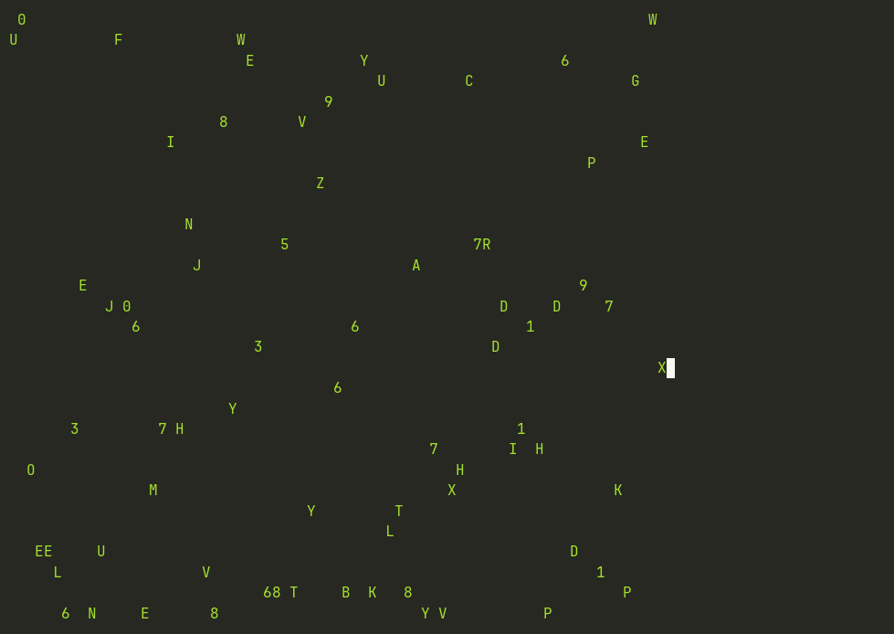

# term

A small, cross-platform terminal library for Zig, inspired by Go's
[`golang.org/x/term`](https://pkg.go.dev/golang.org/x/term).

The goal is to make common terminal operations simple and approachable without
requiring users to deal directly with platform-specific APIs such as `termios`
or Windows Console APIs.

## Features

* Detect whether a file is a terminal
* Enable and restore raw terminal mode
* Get terminal size
* Read terminal state
* Read passwords without echoing input
* Cross-platform API

## Example

```zig
const std = @import("std");
const term = @import("term");

pub fn main() !void {
    const stdin = std.Io.File.stdin();

    if (!term.isTerminal(stdin)) {
        return;
    }

    const state = try term.makeRaw(stdin);
    defer term.restore(stdin, state) catch {};

    const size = try term.getSize(stdin);

    std.debug.print("Terminal: {}x{}\n", .{ size.width, size.height });
}
```

## API

The core API is intentionally small:

```zig
term.isTerminal(file)
term.makeRaw(file)
term.restore(file, state)
term.getState(file)
term.getSize(file)
term.readPassword(allocator, file)
```

The API is inspired by Go's `golang.org/x/term`, while following Zig's
conventions where appropriate.

## Status

🚧 **Early development**

The API and implementation are still evolving.

## Support

| Function       | Linux | macOS | BSD | Windows |
| -------------- | :---: | :---: | :-: | :-----: |
| `isTerminal`   |   ✅  |   🚧  |  🚧 |    ✅   |
| `getSize`      |   ✅  |   🚧  |  🚧 |    ✅   |
| `getState`     |   ✅  |   🚧  |  🚧 |    ✅   |
| `makeRaw`      |   ✅  |   🚧  |  🚧 |    ✅   |
| `restore`      |   ✅  |   🚧  |  🚧 |    ✅   |
| `readPassword` |   🚧  |   🚧  |  🚧 |    🚧   |

### A note on the Windows implementation

The Windows backend talks to the Win32 Console API directly:
`GetConsoleMode` and `SetConsoleMode` for terminal mode,
`GetConsoleScreenBufferInfo` for size. It deserves more caution than the POSIX
side. `termios` is stable, well documented and behaves consistently across
systems, whereas console mode is a flat bitmask whose details vary between
console hosts, and there is no direct equivalent of `cfmakeraw` to copy from.

So far it has only been exercised on Windows 11 with the classic conhost, not
against Windows Terminal or ConPTY. The set of flags cleared by `makeRaw` is a
judgement call rather than a documented constant. Reports from other hosts are
welcome.

### Legend

* ✅ Supported
* 🚧 Planned / in development
* ❌ Not supported

## Examples

More complete programs live in
[zig-term-demos](https://github.com/hmleal/zig-term-demos).

### Matrix rain



A full-screen matrix rain effect. It reads the terminal size with `getSize`,
switches to raw mode with `makeRaw` so keystrokes arrive unbuffered, and
restores the previous terminal state on exit. Press `q` or `Ctrl-C` to quit —
no `Enter` needed, because canonical mode is off.

## Goals

The project aims to provide a simple terminal abstraction for Zig programs,
particularly for CLI applications, without requiring users to understand
platform-specific terminal APIs.

## License

MIT
